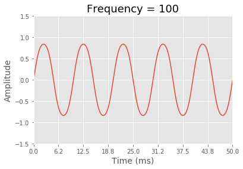

# chords
 Create, visualize, and generate wav files for chords.

# Get started
If you just want to start playing around with chords, the code below will get you started. This example will create a C4 major chord, plot it, and create a .wav file. I recommend testing out different values for duration, to see how the waveform looks at different resolutions.
```python
from waveform import Waveform
from chord import Chord
from note import Note
import helpers


sample_rate = 44100
duration = 2

chord = Chord(root='C4', quality='major')

waveform = chord.get_waveform(sample_rate, duration)
waveform.plot(chord.name)
waveform.to_wav(f'{chord.name}.wav')
```

# Creating chords
There are a few different ways to create chords, depending on what you're doing.

### Create a chord using a root and quality
```python
chord = Chord(root='C4', quality='major')
```

### Create a chord with notes of any frequency
```python
notes = helpers.create_notes_with_frequencies([200, 250, 300])
chord = Chord(notes=notes)
```

### Create a chord with notes of any frequency & velocity
This example creates a sawtooth wave
```python
notes = [Note(frequency=100, velocity=1),
         Note(frequency=200, velocity=0.5),
         Note(frequency=300, velocity=0.35),
         Note(frequency=400, velocity=0.3),
         Note(frequency=500, velocity=0.25),
         Note(frequency=600, velocity=0.2),
         Note(frequency=700, velocity=0.18),
         Note(frequency=800, velocity=0.15),
         Note(frequency=900, velocity=0.12),
         Note(frequency=1000, velocity=0.09)]
chord = Chord(notes=notes)
```


# Visualizing chords
Once you've created a chord, you might want to visualize it and see what it looks like. The waveforms you'll be generating here will most likely be hundreds or thousands of hertz, so you'll want a very short duration - this example is just 250ms!
```python
sample_rate = 44100
duration = 0.25

waveform = chord.get_waveform(sample_rate, duration)
waveform.plot(chord.name)
```


# Generating .wav files
```python
sample_rate = 44100
duration = 4

waveform = chord.get_waveform(sample_rate, duration)
waveform.to_wav(f'{chord.name}.wav')
```


# Add waveforms together
Perhaps you want to see what it looks like when 2 chords are added together. This example uses 2 chords with just one note each, to keep things simple.
```python
chord1 = Chord(notes=[Note(frequency=100)])
chord2 = Chord(notes=[Note(frequency=300)])

sample_rate = 44100
duration = 0.1

waveform1 = chord1.get_waveform(sample_rate, duration)
waveform2 = chord2.get_waveform(sample_rate, duration)
waveform = Waveform.add(waveform1, waveform2)

waveform.plot('Added waveforms')
```
\
\

